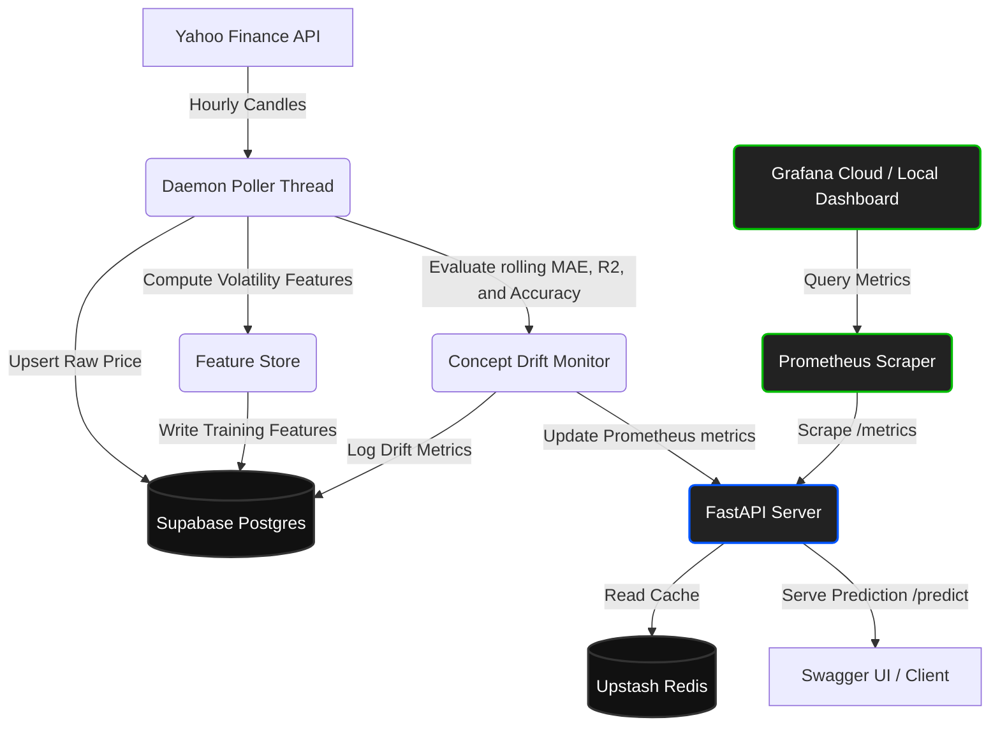

# Nifty 50 Volatility Forecast & MLOps Monitoring Pipeline

An institutional-grade, 24/7 Machine Learning pipeline that predicts short-term (5-hour ahead) realized volatility swings for the **Nifty 50 Index (`^NSEI`)** and **India VIX (`^INDIAVIX`)** using a custom PyTorch Attention-GRU Regressor.

It continuously ingests live price data, computes fractional-differentiation indicators, serves low-latency predictions cached via Upstash Redis, tracks concept drift, and exports metrics to Prometheus and Grafana.

---

## 🏗️ System Architecture



---

##  Core Features

### 1. Advanced Time-Series Features
*   **Fractional Differentiation ($d=0.40$):** Retains long-term historical memory in close prices while ensuring mathematical stationarity for the PyTorch network.
*   **Volatility Indicators:** Tracks multi-lag rolling realized volatility (`5`, `10`, and `20` hours), atr percentage, hl spread, VIX return, and hourly/weekly cyclical time signatures.

### 2. PyTorch Attention-GRU Regressor
*   **Architecture:** Combines a 2-layer Gated Recurrent Unit (GRU) with a Temporal Prior Attention Head to focus on critical price intervals.
*   **Performance:** Achieves an out-of-sample **`30.05%` $R^2$ score** (explained variance) and **`77.94%` Directional Accuracy** (predicting rise vs. fall of volatility).

### 3. Concept Drift & Performance Monitoring
*   Evaluates the model's accuracy, Mean Absolute Error (MAE), and $R^2$ score over a rolling 100-hour window.
*   Logs metrics directly to the `model_drift_metrics` table in Supabase.
*   **Drift Alert:** Automatically triggers a `drift_detected` warning if the directional prediction accuracy falls below **60%**.

### 4. Low-Latency API Serving & Caching
*   **Caching:** Leverages Upstash Redis serverless cache to serve forecasts in under **20 milliseconds** without database bottlenecking.
*   **Prometheus Exporter:** Exposes gauges for index price, VIX fear levels, forecasted volatility, realized volatility, expected change, accuracy, and drift status.
*   **Model Promotion Gate (`/promote`):** Displays a dashboard page showing active model details and Postgres drift logs.

---

##  Project Structure

```text
crypto/
├── models/             # Local registry for active weights and scale models
│   ├── attention_regressor.pt
│   ├── scaler_regressor.pkl
│   └── metrics.json
├── src/
│   ├── api.py          # FastAPI app, Redis caching, Prometheus gauges, and Promote Dashboard
│   ├── poll.py         # Live ingestion, feature calculation, database upsert, and inference
│   ├── feature_store.py# Historical training data merger and feature processing
│   ├── features.py     # Volatility indicators and Fractional Differentiation calculation
│   ├── ingest.py       # Historical candles bulk download
│   ├── db_schema.py    # Schema definitions for Supabase Postgres
│   ├── drift.py        # Rolling performance calculator and drift logger
│   ├── backtest_vol.py # Option straddle trade simulator and performance backtest
│   └── config.py       # Database configs and feature parameters
├── tests/              # PyTest CI/CD suite
│   └── test_pipeline.py
├── docker-compose.yml  # Local stack orchestrator (Postgres, Redis, App, Prometheus, Grafana)
└── prometheus.yml      # Local scraping target file
```

---

## 🐳 Running the Containerized Stack

1.  Start Docker Desktop.
2.  Boot the entire stack (database, cache, FastAPI, poller, Prometheus, and Grafana) locally:
    ```bash
    docker-compose up --build -d
    ```
3.  Access local dashboards:
    *   🔌 **FastAPI Swagger Docs:** `http://localhost:8000/docs`
    *   📊 **Model Registry Dashboard:** `http://localhost:8000/promote`
    *   📈 **Prometheus Scraper:** `http://localhost:9090`
    *   🎨 **Grafana Visualization:** `http://localhost:3000` (Login: `admin` / `admin`)

