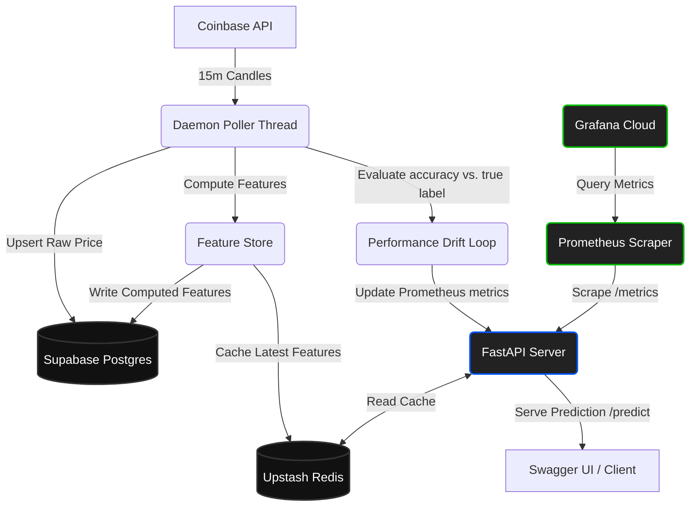

# Real-Time Crypto Prediction & MLOps Monitoring Pipeline

An enterprise-grade, 24/7 Machine Learning pipeline that predicts short-term (15-minute) price direction (UP/DOWN) for **BTC-USD** and **ETH-USD** using an optimized XGBoost classifier. 

It continuously ingests live price data, computes streaming technical indicators, serves low-latency predictions, tracks live accuracy, and alerts on performance drift via Prometheus and Grafana Cloud.

---

## 🏗️ System Architecture



---

##  Core Features

### 1. Real-Time Ingestion & Streaming Feature Store
*   **Data Source:** Ingests live 15-minute price candles from the **Coinbase Exchange API** (US-safe, rate-limit-resistant).
*   **Ingested Schema:** `open`, `high`, `low`, `close`, `volume`, and `ticker`.
*   **Streaming Indicators:** Generates 7 mathematical features in real-time, including:
    *   Relative Strength Index (RSI)
    *   SMA Crossover Signal
    *   Rolling Volatility
    *   Volume Delta
    *   Multi-interval Lagged Returns (1, 3, and 5 candles)

### 2. High-Availability Daemon Poller Thread
*   Starts natively inside FastAPI's startup event (`app.on_event("startup")`) as a background daemon process.
*   Bypasses typical process-reaper setups on free hosting (like Render) by running inside the main web server process.
*   Saves prices to Postgres, updates features, evaluates accuracy, and caches the latest indicators to Redis every 60 seconds.

### 3. Live Performance Drift Monitoring (Concept Drift)
Instead of static statistical data-drift (KS-test), the system implements **Performance-Drift monitoring**:
*   Every 15 minutes (on candle close), the poller evaluates the model's previous prediction against the actual price change.
*   Maintains a rolling **100-prediction sliding window** in Redis.
*   Exposes live correctness states (`predicted_direction` vs. `true_direction`) and rolling accuracy metrics directly to Prometheus.
*   **Performance Drift Threshold:** Triggers a `drift_detected` alert (`1.0`) if the rolling accuracy falls below **50% (coin-flip level)**.

### 4. Low-Latency API serving
*   **Predictions (`/predict/{ticker}`):** Fetches the pre-computed feature payload from Upstash Redis and executes the active model in under **20 milliseconds**.
*   **Model Promotion Gate (`/promote`):** Reads the model metadata registry table in Supabase Postgres and renders a visual comparison table showing active version history, parameters, and comparison metrics (XGBoost vs. Random Forest).
*   **Metrics Exporter (`/metrics`):** Exposes Prometheus-format text. Operates entirely in memory with **zero database calls**, preventing memory leaks or OOM issues.

---

##  Project Structure

```text
crypto/
├── models/             # Serialized model weights & metadata
│   ├── active_model.pkl
│   └── model_metadata.json
├── src/
│   ├── api.py          # FastAPI server, prometheus registers, promote HTML view
│   ├── poll.py         # Coinbase API poll, evaluation, prediction logger
│   ├── feature_store.py# Postgres feature calculations and Redis cacher
│   ├── features.py     # Streaming technical indicator logic
│   ├── ingest.py       # Raw database bulk ingestion & psycopg2 numpy adapters
│   ├── drift.py        # Static feature drift library (fallback)
│   └── config.py       # Shared credentials and configurations
├── prometheus.yml      # Cloud scraper configuration
├── Dockerfile.prometheus# Packages the scraper for Render deployment
└── grafana_dashboard.json # 7-panel MLOps live dashboard configuration
```

---

## 🌐 Production URLs & Sitemap

### API Endpoints (Render)
*   🔌 **[API Documentation / Swagger](https://crypto-pipeline-api.onrender.com/docs):** Live predictions and API tests.
*   📊 **[Model Registry Gateway](https://crypto-pipeline-api.onrender.com/promote):** Model metadata comparison panel.
*   📈 **[Prometheus metrics](https://crypto-pipeline-api.onrender.com/metrics):** Live performance output.
*   🟢 **[Liveness Check](https://crypto-pipeline-api.onrender.com/health):** Simple server status check.

### Monitoring Infrastructure
*   🕵️‍♂️ **[Prometheus Scraper Server](https://self-healing-crypto-pipeline-1.onrender.com/):** Runs the Prometheus instance scraping the API.
*   🎨 **[Grafana Cloud Dashboard](https://grafana.com):** Renders the MLOps dashboard containing drift status gauges, live accuracy timelines, and predicted vs. actual step-line plots.
